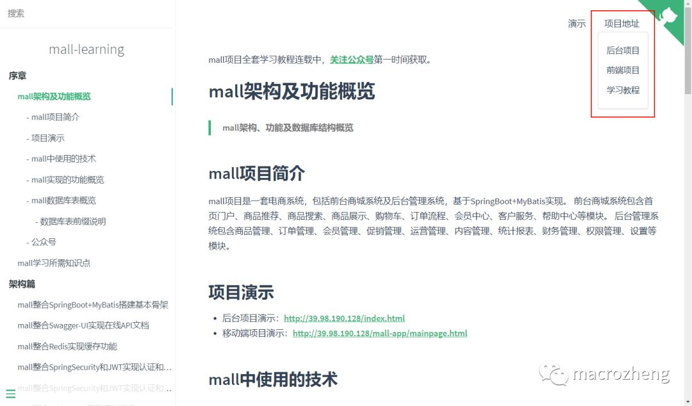
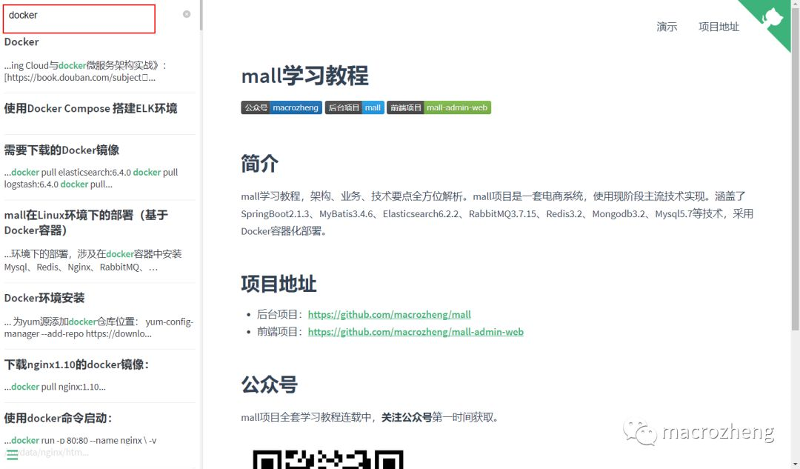
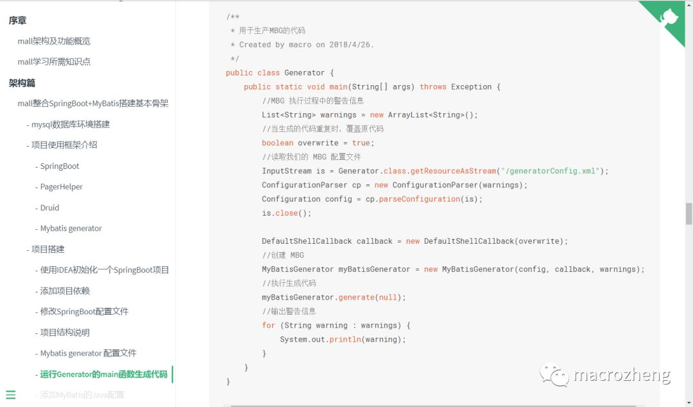
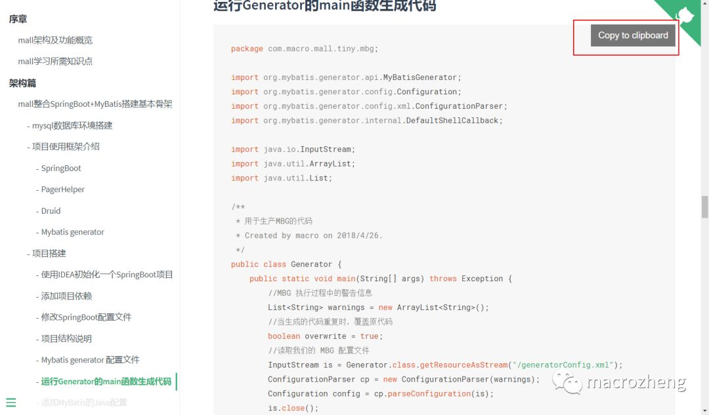
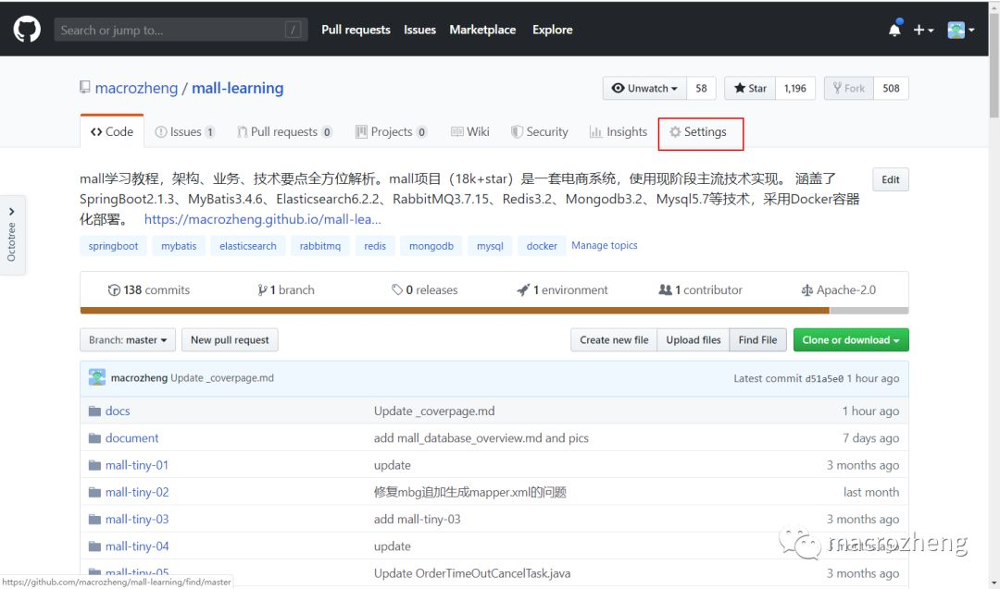
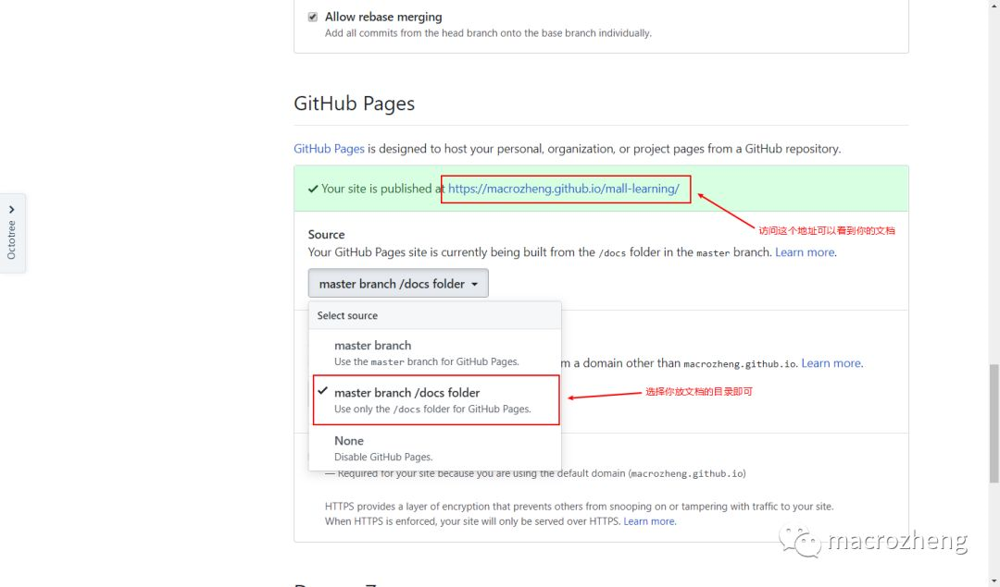

# 如何写出优雅的开源项目文档

### docsify简介

docsify是一个动态生成网站的工具，它不会将.md文件转化为.html文件从而污染你的Github提交记录，所有转化都将在运行时完成。如果你需要快速搭建一个小型文档网站，这将非常实用。

### 初始化项目

#### 安装nodejs

- 下载地址：https://nodejs.org/dist/v8.9.4/node-v8.9.4-x64.msi
- 下载完成后直接安装即可。

#### 安装docsify-cli工具

- 在命令行中执行如下命令：

```
npm i docsify-cli -g
```

- 安装完成后可以方便地在本地实时预览所编辑的文档。

#### 初始化项目结构

- 新建一个docs文件夹，然后执行如下命令：

```
docsify init ./docs
```

- docsify会创建如下结构的目录：

```
  -| docs/
    -| .nojekyll
    -| index.html
    -| README.md
```

#### 实时预览

- 在命令行中输入如下命令：

```
docsify serve docs
```

- 访问该地址即可查看效果：http://localhost:3000/

### 定制侧边栏

- 在index.html中添加侧边栏的配置：

```
<script>
    window.$docsify = {
      loadSidebar: true,
      maxLevel: 2,
      subMaxLevel: 4,
      alias: {
        '/.*/_sidebar.md': '/_sidebar.md'//防止意外回退
      }
    }
  </script>
  <script src="//unpkg.com/docsify/lib/docsify.min.js"></script>
```

- 添加_sidebar.md文件来配置侧边栏：

```
  * 序章
    * [mall架构及功能概览](foreword/mall_foreword_01.md)
    * [mall学习所需知识点](foreword/mall_foreword_02.md)
  * 架构篇
    * [mall整合SpringBoot+MyBatis搭建基本骨架](architect/mall_arch_01.md)
    * [mall整合Swagger-UI实现在线API文档](architect/mall_arch_02.md)
```

- 这样就可以生成一个二级的侧边栏：


### 定制导航栏

- 在index.html中添加导航栏的配置：

```
<script>
    window.$docsify = {
      loadNavbar: true,
      alias: {
        '/.*/_navbar.md': '/_navbar.md'//防止意外回退
      }
    }
  </script>
```

- 添加_navbar.md文件来配置导航栏：

```
  * 演示
    * [后台管理](http://39.98.190.128/index.html)
    * [移动端](http://39.98.190.128/mall-app/mainpage.html)
  * 项目地址
    * [后台项目](https://github.com/macrozheng/mall)
    * [前端项目](https://github.com/macrozheng/mall-admin-web)
    * [学习教程](https://github.com/macrozheng/mall-learning)
```

- 这样就可以在右上角生成两个导航栏：



### 定制封面页

- 在index.html中添加封面页的配置：

```
<script>
    window.$docsify = {
      coverpage: true
    }
  </script>
```

- 添加_coverpage.md文件来配置封面页：

```
  
  # mall-learning
  > mall学习教程，架构、业务、技术要点全方位解析。

  此处填写详细简介。
  [GitHub](https://github.com/macrozheng/mall-learning)
  [Get Started](README.md)
```

- 查看封面页效果：


### 添加全文搜索

- 在index.html中添加全文搜索的配置：

```
<script>
    window.$docsify = {
      search: {
        placeholder: '搜索',
        noData: '找不到结果!',
        depth: 3
      },
    }
  </script>
  <script src="//unpkg.com/docsify/lib/plugins/search.js"></script>
```

- 查看全文搜索效果：



### 添加代码高亮

- 在index.html中添加代码高亮的配置：

```
<script src="//unpkg.com/prismjs/components/prism-bash.js"></script>
  <script src="//unpkg.com/prismjs/components/prism-java.js"></script>
  <script src="//unpkg.com/prismjs/components/prism-sql.js"></script>
```

- 其他支持高亮语言请参考：https://github.com/PrismJS/prism/tree/gh-pages/components
- 查看代码高亮效果：



### 添加一键拷贝代码

- 在index.html中添加一键拷贝代码的配置：

```
<script src="//unpkg.com/docsify-copy-code"></script>
```

- 查看一键拷贝代码效果：



### 在Github上部署文档

- 首先将你的代码提交到Github上去；
- 然后点击项目的Settings按钮：



- 开启GitHub Pages服务：


